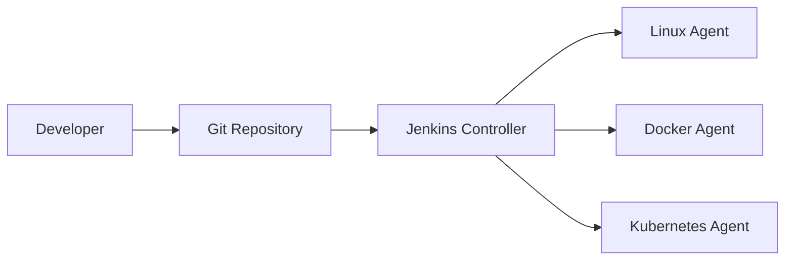
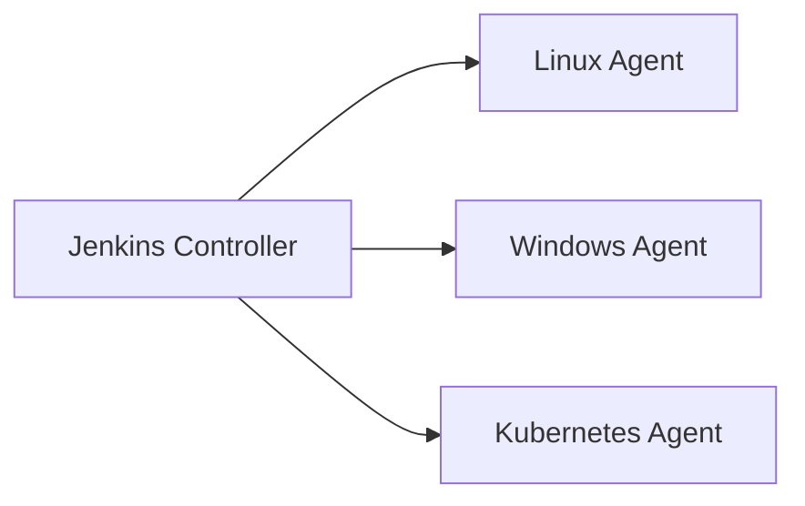

# Jenkins Cheat Sheet

> Comprehensive Jenkins reference for Software Engineers, SREs, Platform Engineers, and DevOps Teams.

---

# Most Common Commands (One-Page Quick Reference)

## Git

```groovy
checkout scm

git branch: 'main',
    url: 'https://github.com/company/repo.git'
```

```groovy
// Maven

sh 'mvn clean package'
sh 'mvn test'

// Gradle
sh './gradlew build'

// Node.js
sh 'npm ci'
sh 'npm test'
sh 'npm run build'


// Python
sh 'pip install -r requirements.txt'
sh 'pytest'

// docker
sh 'docker build -t app:latest .'
sh 'docker push company/app:latest'
```

## Cleanup

```groovy
cleanWs()
deleteDir()
```

## Credentials

```groovy
withCredentials([
  string(credentialsId: 'api-token',
         variable: 'TOKEN')
]) {
    sh 'echo $TOKEN'
}
```

## Kubernetes

```bash
kubectl apply -f deployment.yaml
kubectl rollout restart deployment/app
kubectl rollout undo deployment/app
```

---

# 1. Jenkins Fundamentals

## Jenkins Architecture



## Controller vs Agent

### What the Controller Does

The **Jenkins Controller** (formerly called the **Master**) is the central Jenkins server responsible for managing and orchestrating the entire CI/CD workflow.

Responsibilities include:

* Hosting the Jenkins web UI
* Scheduling and triggering builds
* Managing jobs and pipelines
* Storing configuration and build history
* Distributing work to agents
* Managing plugins and credentials

### What Agents Do

**Agents** (formerly called **Slaves**) are worker machines that execute build and deployment tasks assigned by the Controller.

Common agent responsibilities:

* Checking out source code
* Compiling applications
* Running tests
* Building Docker images
* Deploying applications
* Executing custom scripts

### Controller-Agent Architecture



### Best Practice

> Avoid running builds directly on the Controller in production environments. Use dedicated agents to improve scalability, security, and performance.

| Component  | Primary Responsibility                               |
| ---------- | ---------------------------------------------------- |
| Controller | Manage and orchestrate Jenkins workloads             |
| Agent      | Execute build, test, and deployment tasks            |
| Node       | Any machine managed by Jenkins (Controller or Agent) |
| Executor   | A build slot on a node                               |


## Controller vs Agent

| Feature                | Controller  | Agent    |
| ---------------------- | ----------- | -------- |
| Scheduling             | Yes         | No       |
| Pipeline orchestration | Yes         | No       |
| Executes builds        | Optional    | Yes      |
| Plugin management      | Yes         | No       |
| Distributed builds     | Coordinates | Executes |

### Best Practice

Avoid running builds on the controller.

Use dedicated agents.

---

## Jobs

A Jenkins Job is an automation task.

Examples:

* Build application
* Run tests
* Deploy application
* Execute scripts

---

## Pipeline

Pipeline = Infrastructure as Code for CI/CD.

Stored inside:

```text
Jenkinsfile
```

Benefits:

* Version controlled
* Reusable
* Reviewable
* Auditable

---

## Nodes

A node is any machine Jenkins can execute on.

Examples:

```text
Linux VM
Windows VM
Docker Container
Kubernetes Pod
```

---

## Executors

Executor = Build Slot

Example:

```text
Agent:
  Executors: 4

Result:
  Can run 4 builds simultaneously
```

---

## Freestyle vs Pipeline

| Feature           | Freestyle | Pipeline  |
| ----------------- | --------- | --------- |
| UI Config         | Yes       | Limited   |
| Version Control   | No        | Yes       |
| Reusable          | Low       | High      |
| Complex Workflows | Poor      | Excellent |
| Recommended       | Legacy    | Yes       |

---

# 2. Installation & Setup

## Docker Installation

```bash
docker run -d \
  --name jenkins \
  -p 8080:8080 \
  -p 50000:50000 \
  -v jenkins_home:/var/jenkins_home \
  jenkins/jenkins:lts
```

Open:

```text
http://localhost:8080
```

---

## Linux Installation (Ubuntu)

```bash
sudo apt update

sudo apt install openjdk-17-jdk -y

curl -fsSL https://pkg.jenkins.io/debian-stable/jenkins.io-2023.key \
| sudo tee \
/usr/share/keyrings/jenkins-keyring.asc > /dev/null

echo deb \
[signed-by=/usr/share/keyrings/jenkins-keyring.asc] \
https://pkg.jenkins.io/debian-stable binary/ \
| sudo tee \
/etc/apt/sources.list.d/jenkins.list > /dev/null

sudo apt update

sudo apt install jenkins -y
```

Start service:

```bash
sudo systemctl enable jenkins
sudo systemctl start jenkins
```

---

## Initial Setup

Unlock Jenkins:

```bash
sudo cat \
/var/lib/jenkins/secrets/initialAdminPassword
```

Steps:

1. Unlock Jenkins
2. Install suggested plugins
3. Create admin user
4. Configure URL

---

## Plugin Management

Manage Jenkins → Plugins

Common plugins:

| Plugin      | Purpose           |
| ----------- | ----------------- |
| Git         | SCM               |
| Pipeline    | CI/CD             |
| Docker      | Docker support    |
| Kubernetes  | K8s agents        |
| Blue Ocean  | UI                |
| Credentials | Secret management |

---

# 3. Jenkinsfile Examples

## Declarative Pipeline

```groovy
pipeline {
    agent any

    stages {

        stage('Build') {
            steps {
                echo 'Building'
            }
        }

        stage('Test') {
            steps {
                echo 'Testing'
            }
        }

        stage('Deploy') {
            steps {
                echo 'Deploying'
            }
        }
    }
}
```

---

## Scripted Pipeline

```groovy
node {

    stage('Build') {
        sh 'mvn clean package'
    }

    stage('Test') {
        sh 'mvn test'
    }

    stage('Deploy') {
        sh './deploy.sh'
    }
}
```

---

## Multi-Stage CI/CD Pipeline

```groovy
pipeline {

 agent any

 stages {

   stage('Checkout') {
     steps {
       checkout scm
     }
   }

   stage('Build') {
     steps {
       sh 'mvn clean package'
     }
   }

   stage('Test') {
     steps {
       sh 'mvn test'
     }
   }

   stage('Package') {
     steps {
       archiveArtifacts '*.jar'
     }
   }

   stage('Deploy') {
     steps {
       sh './deploy.sh'
     }
   }
 }
}
```

---

## Parallel Stages

```groovy
pipeline {

 agent any

 stages {

   stage('Tests') {

      parallel {

          stage('Unit') {
              steps {
                  sh 'mvn test'
              }
          }

          stage('Integration') {
              steps {
                  sh './integration-tests.sh'
              }
          }

          stage('Security') {
              steps {
                  sh './security-scan.sh'
              }
          }
      }
   }
 }
}
```

---

## Matrix Builds

```groovy
pipeline {

 agent none

 stages {

   stage('Matrix') {

      matrix {

         axes {

            axis {
               name 'OS'
               values 'linux','windows'
            }

            axis {
               name 'JDK'
               values '17','21'
            }
         }

         agent any

         stages {

            stage('Build') {
                steps {
                    echo "OS=${OS}"
                    echo "JDK=${JDK}"
                }
            }
         }
      }
   }
 }
}
```

---

# 4. Common Pipeline Syntax

## pipeline

```groovy
pipeline {
}
```

Top-level container.

---

## agent

```groovy
agent any
```

```groovy
agent {
    label 'linux'
}
```

---

## stages

```groovy
stages {
}
```

---

## stage

```groovy
stage('Build')
```

---

## steps

```groovy
steps {
    sh 'mvn package'
}
```

---

## environment

```groovy
environment {
    APP_ENV='prod'
}
```

---

## parameters

```groovy
parameters {
    string(
        name: 'VERSION',
        defaultValue: '1.0'
    )
}
```

---

## when

```groovy
when {
    branch 'main'
}
```

---

## post

```groovy
post {

    success {
        echo 'Success'
    }

    failure {
        echo 'Failure'
    }
}
```

---

## options

```groovy
options {
    timeout(time: 30, unit: 'MINUTES')
}
```

---

## triggers

```groovy
triggers {
    cron('H/15 * * * *')
}
```

---

# 5. Git Integration

## Checkout Repository

```groovy
checkout scm
```

Explicit:

```groovy
git branch: 'main',
    url: 'https://github.com/org/repo.git'
```

## Branch Builds

```groovy
when {
    branch 'develop'
}
```

## Pull Request Builds

```groovy
when {
    changeRequest()
}
```

## Git Credentials

```groovy
git credentialsId: 'github-creds',
    branch: 'main',
    url: 'git@github.com:org/repo.git'
```

## GitHub Webhook

GitHub:

```text
Settings
→ Webhooks
→ Add Webhook
```

Payload URL:

```text
https://jenkins.company.com/github-webhook/
```

Content Type:

```text
application/json
```

Events:

```text
Push
Pull Request
```
