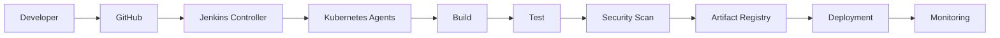

# Jenkins Cheat Sheet — Part 3

## 11. Shared Libraries

Shared Libraries allow teams to centralize reusable pipeline logic.

---

## Why Use Shared Libraries?

Without Shared Libraries:

```groovy
sh 'mvn clean package'
sh 'mvn test'
sh './deploy.sh'
```

repeated across dozens of repositories.

With Shared Libraries:

```groovy
buildApp()
testApp()
deployApp()
```

Benefits:

* Reusability
* Standardization
* Reduced duplication
* Easier maintenance
* Better governance

---

## Repository Structure

```text
(shared-library)
│
├── vars/
│   ├── buildApp.groovy
│   ├── deployApp.groovy
│   └── notifySlack.groovy
│
├── src/
│   └── com/company/
│       └── Deployment.groovy
│
├── resources/
│   └── templates/
│
└── README.md
```

---

## vars Directory

Files under `vars/` become globally available pipeline functions.

Example:

```groovy
// vars/buildApp.groovy

def call() {
    sh 'mvn clean package'
}
```

Usage:

```groovy
@Library('shared-lib') _

buildApp()
```

---

## src Directory

Contains Groovy classes.

Example:

```groovy
package com.company

class Deployment implements Serializable {

    def steps

    Deployment(steps) {
        this.steps = steps
    }

    def deploy() {
        steps.sh './deploy.sh'
    }
}
```

Usage:

```groovy
def deployment =
    new com.company.Deployment(this)

deployment.deploy()
```

---

## Global Shared Library Configuration

```text
Manage Jenkins
→ System
→ Global Pipeline Libraries
```

Example:

```text
Library Name: shared-lib
Default Version: main
Retrieval Method: Git
```

---

## Loading Dynamically

```groovy
library 'shared-lib'
```

Specific version:

```groovy
library 'shared-lib@release-v2'
```

---

## Best Practices

### Keep Libraries Small

Good:

```groovy
buildApp()
```

Bad:

```groovy
megaPipelineEverything()
```

---

### Version Libraries

```groovy
library 'shared-lib@v1.2.0'
```

---

### Unit Test Libraries

Use:

```text
JenkinsPipelineUnit
```

---

### Document Public APIs

Provide examples:

```groovy
deployApp(
    environment: 'prod'
)
```

---

# 12. Administration Commands

---

## Jenkins Home Directory

Common location:

```text
/var/lib/jenkins
```

Contains:

```text
jobs/
plugins/
users/
workspace/
secrets/
```

---

## Backup Jenkins

### Simple Backup

```bash
sudo systemctl stop jenkins

tar -czf \
jenkins-backup.tar.gz \
/var/lib/jenkins

sudo systemctl start jenkins
```

---

### Backup Important Directories

```text
jobs/
plugins/
users/
secrets/
credentials.xml
config.xml
```

---

## Restore Jenkins

```bash
sudo systemctl stop jenkins

tar -xzf \
jenkins-backup.tar.gz \
-C /

sudo systemctl start jenkins
```

---

## Restart Jenkins

Linux:

```bash
sudo systemctl restart jenkins
```

---

## Reload Configuration

Without restart:

```text
http://JENKINS_URL/reload
```

---

## Safe Restart

Waits for builds to finish.

```text
http://JENKINS_URL/safeRestart
```

---

## Plugin Updates

```text
Manage Jenkins
→ Plugins
→ Updates
```

---

## Script Console

```text
Manage Jenkins
→ Script Console
```

Powerful and dangerous.

Administrator only.

---

## List Jobs via Groovy

```groovy
Jenkins.instance.jobs.each {
    println(it.name)
}
```

---

## List Nodes

```groovy
Jenkins.instance.nodes.each {
    println(it.displayName)
}
```

---

## User Management

```text
Manage Jenkins
→ Security
→ Users
```

Common actions:

* Create user
* Disable user
* Reset password
* Assign roles

---

## RBAC Recommendation

Install:

```text
Role-Based Authorization Strategy Plugin
```

Example Roles:

| Role            | Permissions |
| --------------- | ----------- |
| Admin           | Full access |
| Developer       | Build jobs  |
| Viewer          | Read only   |
| Release Manager | Deploy      |

---

# 13. Troubleshooting

---

## Build Failures

### Common Causes

| Cause        | Example           |
| ------------ | ----------------- |
| Compilation  | Syntax errors     |
| Dependency   | Missing package   |
| Test failure | Assertion failure |
| Environment  | Missing variable  |
| Permission   | Access denied     |

---

### Debugging Checklist

```text
✓ Review console output
✓ Verify environment variables
✓ Verify credentials
✓ Verify dependencies
✓ Reproduce locally
```

---

## Agent Offline

Symptoms:

```text
Node marked offline
```

Check:

### Network

```bash
ping controller
```

---

### Java Version

```bash
java -version
```

---

### Agent Logs

```bash
journalctl -u jenkins
```

---

### Agent Secret

Verify:

```text
Node Configuration
```

---

## Workspace Issues

### Clean Workspace

```groovy
cleanWs()
```

---

### Delete Workspace

```groovy
deleteDir()
```

---

### Large Workspaces

Use:

```groovy
cleanWs(
    deleteDirs: true
)
```

---

## Permission Problems

Example:

```text
Permission denied
```

Fix:

```bash
chmod +x deploy.sh
```

---

## Git Checkout Errors

### Authentication Failed

Verify:

```text
Credentials ID
SSH Key
PAT Token
```

---

### Repository Not Found

Verify:

```text
Repository URL
Permissions
Branch Name
```

---

## Docker Errors

### Cannot Connect to Docker

```text
Cannot connect to Docker daemon
```

Fix:

```bash
sudo systemctl start docker
```

---

### Permission Denied

```bash
sudo usermod -aG docker jenkins
```

Restart Jenkins afterward.

---

## Kubernetes Errors

### Pod Pending

Check:

```bash
kubectl describe pod POD_NAME
```

---

### Image Pull Error

Check:

```text
Image Name
Registry Access
ImagePullSecret
```

---

## Out Of Disk Space

Check:

```bash
df -h
```

Clean:

```bash
docker system prune -a
```

---

## Jenkins Won't Start

Check:

```bash
systemctl status jenkins
```

Logs:

```bash
journalctl -xe
```

---

## Common Jenkins Errors

### No Such DSL Method

```text
No such DSL method
```

Cause:

* Missing plugin
* Typo
* Unsupported syntax

---

### Missing Context Variable

```text
MissingContextVariableException
```

Cause:

Pipeline step outside node context.

---

### Script Approval Required

```text
RejectedAccessException
```

Fix:

```text
Manage Jenkins
→ In-Process Script Approval
```

---

# 14. Performance & Security Best Practices

---

# Security Best Practices

---

## Never Hardcode Secrets

Bad:

```groovy
def token =
'123456'
```

Good:

```groovy
withCredentials(...)
```

---

## Mask Credentials

Use:

```groovy
withCredentials()
```

Never:

```groovy
echo TOKEN
```

---

## Use Least Privilege

Grant only required permissions.

---

## Enable RBAC

Recommended plugin:

```text
Role-Based Authorization Strategy
```

---

## Secure Jenkins URL

Use:

```text
HTTPS
TLS Certificates
Reverse Proxy
```

---

## Disable Anonymous Access

```text
Manage Jenkins
→ Security
```

---

## Audit Changes

Install:

```text
Audit Trail Plugin
```

---

## Rotate Secrets

Suggested rotation:

| Secret Type | Rotation |
| ----------- | -------- |
| API Tokens  | 90 Days  |
| Passwords   | 90 Days  |
| SSH Keys    | 180 Days |

---

# Performance Best Practices

---

## Use Dedicated Agents

Avoid:

```text
Controller Builds
```

Use:

```text
Linux Agents
Docker Agents
Kubernetes Agents
```

---

## Parallelize Work

Example:

```groovy
parallel(
 unitTests: {
   sh 'mvn test'
 },
 integrationTests: {
   sh './integration.sh'
 }
)
```

---

## Use Caching

Examples:

```text
Maven Repository
NPM Cache
Docker Layers
Gradle Cache
```

---

## Limit Build Retention

```groovy
options {

 buildDiscarder(
   logRotator(
      numToKeepStr: '20'
   )
 )
}
```

---

## Archive Only Required Files

Bad:

```groovy
archiveArtifacts '**/*'
```

Good:

```groovy
archiveArtifacts '*.jar'
```

---

## Use Ephemeral Agents

Recommended:

```text
Kubernetes Pods
Docker Containers
```

Benefits:

* Clean environment
* Scalability
* Isolation

---

## Backup Strategy

### Daily

```text
Jobs
Credentials
Configuration
```

### Weekly

```text
Full Jenkins Backup
```

### Monthly

```text
Disaster Recovery Test
```

---

# 15. Quick Reference Tables

---

## Frequently Used Pipeline Commands

| Command            | Purpose                 |
| ------------------ | ----------------------- |
| stage()            | Stage definition        |
| sh()               | Execute shell           |
| bat()              | Execute Windows command |
| echo()             | Print message           |
| checkout()         | SCM checkout            |
| archiveArtifacts() | Store artifacts         |
| cleanWs()          | Clean workspace         |
| timeout()          | Limit execution         |
| retry()            | Retry operation         |
| parallel()         | Parallel execution      |

---

## Common Environment Variables

| Variable      | Description    |
| ------------- | -------------- |
| BUILD_ID      | Build ID       |
| BUILD_NUMBER  | Build Number   |
| BUILD_TAG     | Build Tag      |
| JOB_NAME      | Job Name       |
| JOB_BASE_NAME | Base Job Name  |
| WORKSPACE     | Workspace Path |
| NODE_NAME     | Agent Name     |
| BRANCH_NAME   | Git Branch     |
| GIT_COMMIT    | Commit SHA     |
| GIT_BRANCH    | Branch         |

---

## Jenkins URLs

| URL            | Purpose        |
| -------------- | -------------- |
| /manage        | Administration |
| /configure     | Global Config  |
| /script        | Script Console |
| /credentials   | Credentials    |
| /pluginManager | Plugins        |
| /computer      | Nodes          |
| /safeRestart   | Safe Restart   |
| /reload        | Reload Config  |

---

## Build Status Values

| Status    | Meaning      |
| --------- | ------------ |
| SUCCESS   | Build Passed |
| FAILURE   | Build Failed |
| UNSTABLE  | Test Failure |
| ABORTED   | Stopped      |
| NOT_BUILT | Skipped      |

---

## Cron Examples

| Schedule        | Expression    |
| --------------- | ------------- |
| Every 5 Minutes | `H/5 * * * *` |
| Hourly          | `H * * * *`   |
| Daily           | `H H * * *`   |
| Weekly          | `H H * * 0`   |
| Monthly         | `H H 1 * *`   |

---

## Jenkins CLI

Download:

```bash
wget \
http://localhost:8080/jnlpJars/jenkins-cli.jar
```

---

### List Jobs

```bash
java -jar jenkins-cli.jar \
-s http://localhost:8080 \
list-jobs
```

---

### Build Job

```bash
java -jar jenkins-cli.jar \
-s http://localhost:8080 \
build my-job
```

---

### Get Job Config

```bash
java -jar jenkins-cli.jar \
-s http://localhost:8080 \
get-job my-job
```

---

### Create Job

```bash
java -jar jenkins-cli.jar \
-s http://localhost:8080 \
create-job my-job \
< config.xml
```

---

# 16. Interview Questions

---

# Beginner

### What is Jenkins?

Open-source automation server used for CI/CD.

---

### What is a Pipeline?

Pipeline-as-Code workflow stored in a Jenkinsfile.

---

### What is an Agent?

Machine that executes builds.

---

### What is a Node?

Any machine managed by Jenkins.

---

### Difference Between Freestyle and Pipeline?

Freestyle:

* UI configured

Pipeline:

* Code based
* Version controlled

---

# Intermediate

### Declarative vs Scripted Pipeline?

| Declarative | Scripted      |
| ----------- | ------------- |
| Structured  | Flexible      |
| Easier      | More Powerful |
| Recommended | Advanced Use  |

---

### What are Shared Libraries?

Reusable pipeline code shared across repositories.

---

### What is Blue Ocean?

Modern Jenkins visualization UI.

---

### How Do Credentials Work?

Secrets stored securely and injected at runtime.

---

### How Do Webhooks Work?

Git events trigger Jenkins automatically.

---

# Advanced

### How Would You Scale Jenkins?

Answer:

* Multiple agents
* Kubernetes agents
* Shared libraries
* Build queues
* Controller isolation

---

### How Do You Secure Jenkins?

Expected points:

* RBAC
* HTTPS
* Credential Store
* Secret Rotation
* Audit Logs
* Agent Isolation

---

### How Would You Design Enterprise CI/CD?

Example architecture:



---

### How Do You Optimize Slow Pipelines?

Expected answers:

* Parallel stages
* Caching
* Ephemeral agents
* Artifact reuse
* Incremental builds
* Matrix builds
* Faster test strategy

---

### Explain Jenkins High Availability

Common approaches:

* External database (if applicable)
* Backups
* Controller redundancy strategy
* Kubernetes deployment
* Shared storage
* Disaster recovery plan

---

# Production Jenkins Checklist

```text
✓ Jenkinsfile in source control
✓ Shared libraries
✓ RBAC enabled
✓ HTTPS enabled
✓ Secrets in credentials store
✓ Backups automated
✓ Dedicated agents
✓ Monitoring enabled
✓ Log aggregation enabled
✓ Plugin updates reviewed
✓ Build retention configured
✓ Kubernetes/Docker agents preferred
✓ Audit logging enabled
✓ Disaster recovery tested
✓ Security scanning integrated
```


